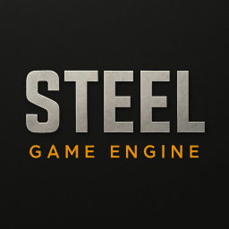

#  STEEL Game Engine

A retro 3D game engine for Windows 95 using C++, Lua, Irrlicht and SoLoud.



## Generating documentation

```shell
rmdir doc_out
doxygen
python gen_doc.py
```

## TODO

* Emscripten build.
* Documentation.
* Fix Irrlicht 1.3.1 collisions.
* Joystick support.
* Shadows.
* Terrain.
* Water.
